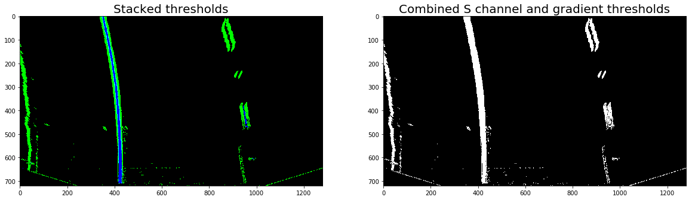
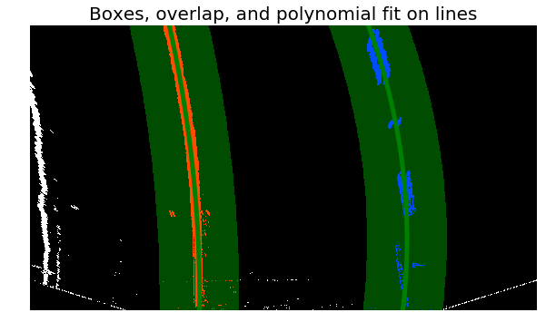

# Advanced Lane Finding

The goals / steps of this project are the following:

* Compute the camera calibration matrix and distortion coefficients given a set of chessboard images.
* Apply a distortion correction to raw images.
* Use color transforms, gradients, etc., to create a thresholded binary image.
* Apply a perspective transform to rectify binary image ("birds-eye view").
* Detect lane pixels and fit to find the lane boundary.
* Determine the curvature of the lane and vehicle position with respect to center.
* Warp the detected lane boundaries back onto the original image.
* Output visual display of the lane boundaries and numerical estimation of lane curvature and vehicle position.

[//]: # (Image References)

[cam-calibration]: ./examples/cam-calibration/cam-calibration.png "Camera Calibration"
[image2]: ./examples/undistorted_example.png "Road Transformed"
[image3]: ./examples/color_thresholds.png "Binary Example"
[image4]: ./examples/blue_lines_on_road.png "Warp Example"
[image5]: ./examples/poly-boxes.png "Fit Visual"
[image6]: ./examples/example_image.png "Output"
[video1]: ./project_video.mp4 "Video"

## [Rubric](https://review.udacity.com/#!/rubrics/571/view) Points

### Here I will consider the rubric points individually and describe how I addressed each point in my implementation.  

---

### Writeup / README

#### 1. This file ([writeup_template.md](writeup_template.md)) includes all the rubric points and how I addressed each one.  

### Camera Calibration

#### 1. I computed the camera matrix and distortion coefficients. Below is an example of a distortion corrected calibration image along with the processes by which I arrived at the camera calibration parameters.

The code for this step is contained in the second code cell of the IPython notebook located in "Pipeline.ipynb". I detect the corners of the chessboards for all the images in the directory specified by `imdir` (which is set to `camera_cal`) in the function `chessboard_corners()`, found in the file [`lane_functions.py`](lane_functions.py), lines 8-57.

This function looks through the image directory and gathers the correspondences into `objpoints` and `imgpoints`. The "object points" are the (x, y, z) coordinates of the chessboard corners in the world. The chessboard is fixed on the (x, y) plane at z=0, such that the object points are the same for each calibration image.  Thus, `objp` is just a replicated array of coordinates, and `objpoints` will be appended with a copy of it every time I successfully detect all chessboard corners in a test image.  `imgpoints` will be appended with the (x, y) pixel position of each of the corners in the image plane with each successful chessboard detection.  

I then used the output `objpoints` and `imgpoints` to compute the camera calibration and distortion coefficients using the `cv2.calibrateCamera()` function.  I applied this distortion correction to the test image using the `cv2.undistort()` function and obtained this result: 

![Camera Calibration Distortion Correction][cam-calibration]

### Pipeline (single images)

#### 1. Provide an example of a distortion-corrected image.

To demonstrate this step, I will describe how I apply the distortion correction to one of the test images like this one:
![alt text][image2]

#### 2. Describe how (and identify where in your code) you used color transforms, gradients or other methods to create a thresholded binary image.  Provide an example of a binary image result.

I used a combination of color and gradient thresholds to generate a binary image (thresholding steps at lines 59 through 100 in the function titled `apply_thresholds`).  Here's an example of my output for this step with the same picture from quizzes.

![alt text][image3]

In reality, I applied test images *after* transformation below, which can be seen below.



#### 3. Describe how (and identify where in your code) you performed a perspective transform and provide an example of a transformed image.

The code for my perspective transform includes a function can be seen in the `Pipeline.ipynb`, the fourth cell.	  I chose the hardcode the source and destination points in the following manner:

```python
src = np.float32(
     [[(img_size[0] / 2) - 55, img_size[1] / 2 + 100],
     [((img_size[0] / 6) - 10), img_size[1]],
     [(img_size[0] * 5 / 6) + 60, img_size[1]],
     [(img_size[0] / 2 + 55), img_size[1] / 2 + 100]])
dst = np.float32(
    [[(img_size[0] / 4) + 35, 0],
     [(img_size[0] / 4), img_size[1]],
     [(img_size[0] * 3 / 4), img_size[1]],
     [(img_size[0] * 3 / 4) - 35, 0]])
```

Both the arrays in the above correspond to the road points in an array that looks like:

**[ UpperLeft, LowerLeft, LowerRight, UpperRight ]**


This resulted in the following source and destination points:

| Source        | Destination   | 
|:-------------:|:-------------:| 
| (585, 460)      | (355, 0)        | 
| (203, 720)      | (355, 720)      |
| (1126, 720)     | (925, 720)      |
| (695, 460)      | (925, 0)        |


I verified that my perspective transform was working as expected by drawing the `src` and `dst` points onto a test image and its warped counterpart to verify that the lines appear parallel in the warped image.

![alt text][image4]

#### 4. Describe how (and identify where in your code) you identified lane-line pixels and fit their positions with a polynomial?

I had several functions to fit polynomials to the binary thresholded image taken from step four of the overhead warped imagery. Depending on the situation, I might like to take a sliding windowed histogram, use a convolution (didn't implement), or use a window around a previously fit function. The choices are evident in the below code.

```
# Determine the left and right polynomials
if slide_conv_poly == 'slide':
    # left_fit, right_fit = find_sliding_poly(combined_binary)
    lr_fit = find_poly_from_hist(combined_binary)
elif slide_conv_poly == 'conv':
    lr_fit = find_poly_from_hist(combined_binary)
elif slide_conv_poly == 'poly':
    lr_fit = find_poly_from_poly(combined_binary, left_fit, right_fit)
```

For fitting a polynomial from a histogram, I implemented a function `find_poly_from_hist` found in `lane_functions.py` from lines 120 to 210. An example of this is shown below:

![alt text][image5]

For fitting a polynomial from another polynomial, I implemented a function `find_poly_from_poly` in `lane_functions.py` which is directly after `find_poly_from_hist`. An example of this is:



#### 5. Radius of Curvature and Vehicle Lane Position

I calculated the radius of curvature in my code functions starting on line 320.

The vehicle offset lane position was calculated with a function called `car_center_offset` starting on line 350 in the python utility functions file `lane_functions.py`. 

In both, I have the option to return in either meters or in pixels with the conditional:

```
357     if meters:
358         xm_per_pix=3.7/700
359     else:
360         xm_per_pix=1.0
```

#### 6. Provide an example image of your result plotted back down onto the road such that the lane area is identified clearly.

My full pipeline is shown in a `detect_lines` function as seen in  the ninth cell in `Pipeline.ipynb`. That gives an example of my result on a test image:

![alt text][image6]

The actual `detect_line` function is seen in `lane_functions.py`.

---

### Pipeline (video)

#### 1. Provide a link to your final video output.  Your pipeline should perform reasonably well on the entire project video (wobbly lines are ok but no catastrophic failures that would cause the car to drive off the road!).

Here's a [link to my video result](output_videos/project_video_output.mp4)

---

### Discussion

Overall, my implementation isn't all that robust. I'm still taking single images and then figuring out whether or not it's found a polynomial before. I re-look for frames every second using `find_poly_from_hist`, but there may be a more principled way of doing that.

Something that could be improved is to edit the pipeline so that there is an averaging effect over all the frames. 

That would involve the more extensive use of the `Line` class.

In general, because I'm anxious to get to the next project, I'll come back and make it better.